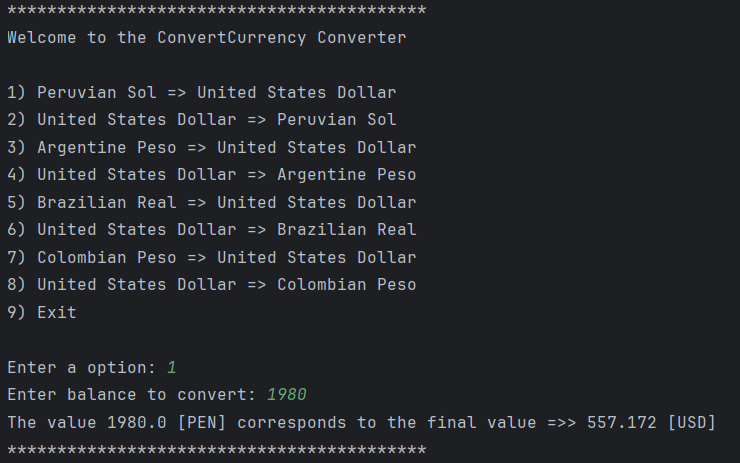
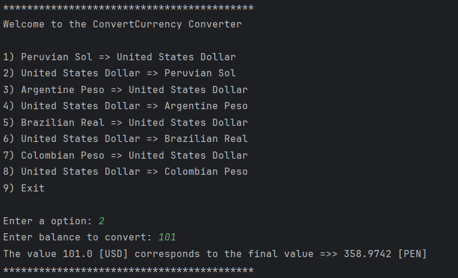
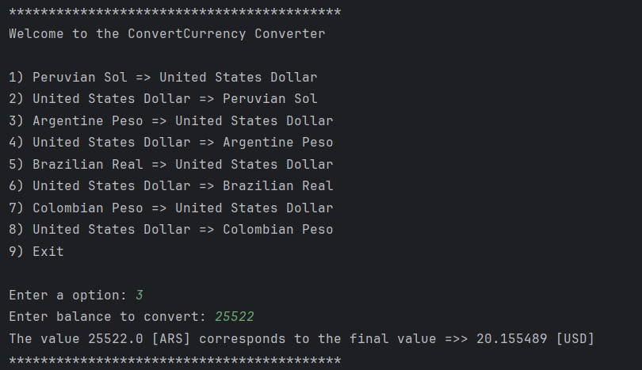
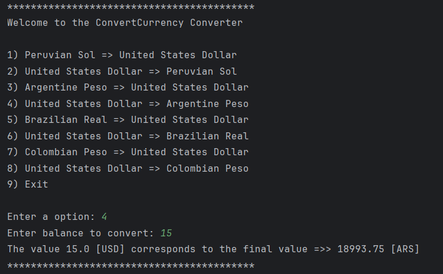
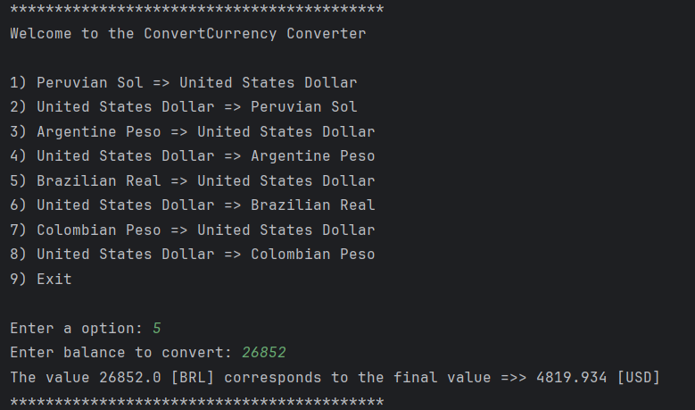
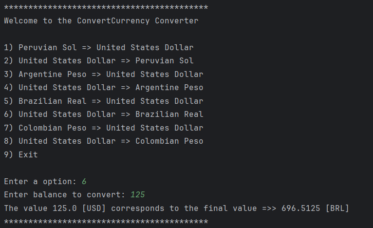
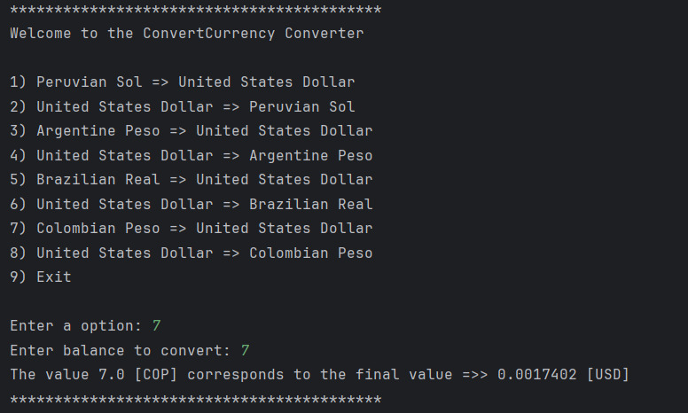
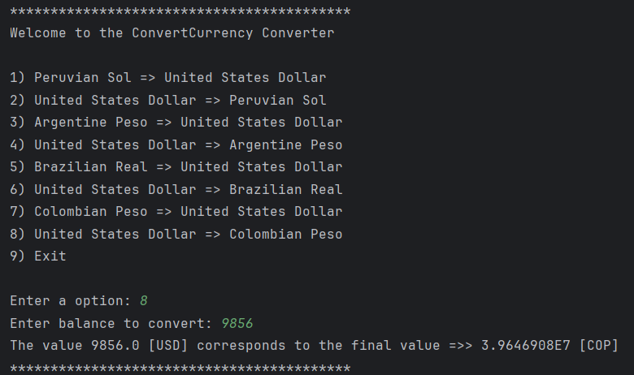

# 💱 Conversor de Monedas – Aplicación en Consola (Java)

Este proyecto fue desarrollado como parte del programa de formación **Oracle Next Education (ONE)** en la etapa Backend.

El código y la interfaz están escritos en inglés, ya que decidí aprovechar el reto para **practicar mi inglés técnico**, con miras a futuras oportunidades internacionales 🌍.

---

## 🎯 ¿Qué hace?

- Permite convertir entre 4 monedas latinoamericanas y el dólar estadounidense (USD)
- Realiza conversiones en **ambos sentidos** (ida y vuelta)
- Usa una **API externa** para obtener el tipo de cambio en tiempo real
- Funciona completamente desde la **línea de comandos (consola)**
- Muestra el valor convertido con retroalimentación clara para el usuario

---

## 🌐 Monedas disponibles

1. Sol Peruano (PEN) ⇄ Dólar Estadounidense (USD)  
2. Peso Argentino (ARS) ⇄ USD  
3. Real Brasileño (BRL) ⇄ USD  
4. Peso Colombiano (COP) ⇄ USD

---

## 🖼 Capturas de pantalla

| Conversión | Imagen |
|------------|--------|
| PEN → USD |  |
| USD → PEN |  |
| ARS → USD |  |
| USD → ARS |  |
| BRL → USD |  |
| USD → BRL |  |
| COP → USD |  |
| USD → COP |  |

📁 Las imágenes están almacenadas en la carpeta `screenshots/` dentro del repositorio.

---

## 🧠 Estructura del proyecto

```
src/
└── com/jhoncodev/currencyConverter/
    ├── main/
    │   └── Main.java
    └── models/
        ├── ConvertCurrency.java
        ├── ConvertJson.java
        ├── CurrencyExchangeAPI.java
        └── UseApi.java
```

---

## 🔧 Tecnologías utilizadas

- Java 24
- IntelliJ IDEA
- ExchangeRate API v6
- Gson para parseo de JSON
- HTTP de Java

---

## 📌 Notas finales

Este proyecto es un ejercicio académico con fines educativos.  
Con este reto demuestro lo aprendido en la ruta Java Orientado a Objetos.

---
